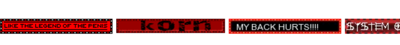

  <kbd> hope this hurts &nbsp;  </kbd> 

  <kbd align="right"> what &nbsp;  </kbd>

 
 ${\textsf{\color{#9e0000}—————————————————————————}}$ 
   ${\textsf{\color{#9e0000}click for more info}}$ 
  

 
 
 <a href="https://shinminase.neocities.org/">neocities</a> • 
 <a href="https://www.ultraguest.com/view/1717388758">guestbook</a> • 
 <a href="https://rentry.co/raidouxiv">ponytown</a> •
  <a href="https://shinminase.github.io/">page</a> 
 

<li>offtab 99% of the time, whisp to int</li>
<li>i like sitting still and looking pretty. be my friend and c+h</li>
<li>temporary layout for halloween</li>

 

