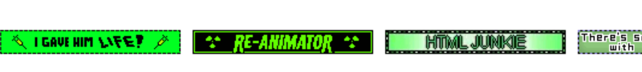

<!-- omg hiiiii ur looking at my raw code . Sorry its super messy LOL this is just how my code normally is --> 
<b>note: 123guestbook is shutting down. there's a recreation called <a href="https://atabook.org/">atabook!</a> </b>
</img>

  howdy, visitor number:   
  
   
  fancy seeing you 'round here.
  
   
   
   
  

  <ul>
    <h4 align="center">
      <a href="https://rentry.co/runoinchrests" target="_blank">interests</a> • <a href="https://shinminase.neocities.org/" target="_blank">neocities</a> • <a href="https://www.ultraguest.com/view/1717388758" target="_blank">cbox + guestbook</a> • <a href="https://rentry.co/raidouxiv" target="_blank">ponytown</a> 
    </h4>
    <li> im usually offtab but feel free to int regardless! </li>
    <li> whisp to interact. miss things in chat a lot</li>
     if i dont reply, it's probably because i didn't see it, sorry! 
    <li> hater of vivziepop shit. hazbinnies suffer my wrath </li>
    <li> please interact if we have any interests in common i lauv meeting ppl! </li>
  </ul>

</img>

  
<i>currently learning....</i>

            

